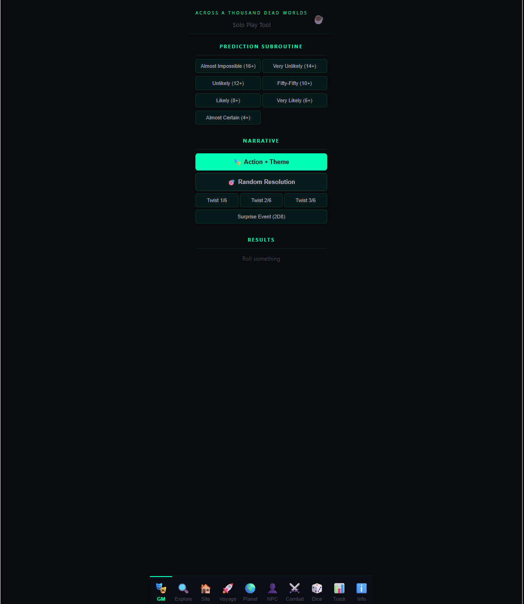
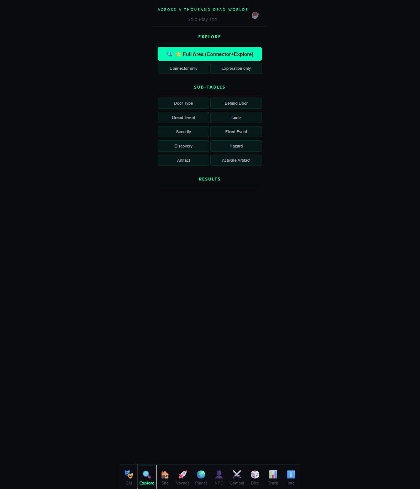
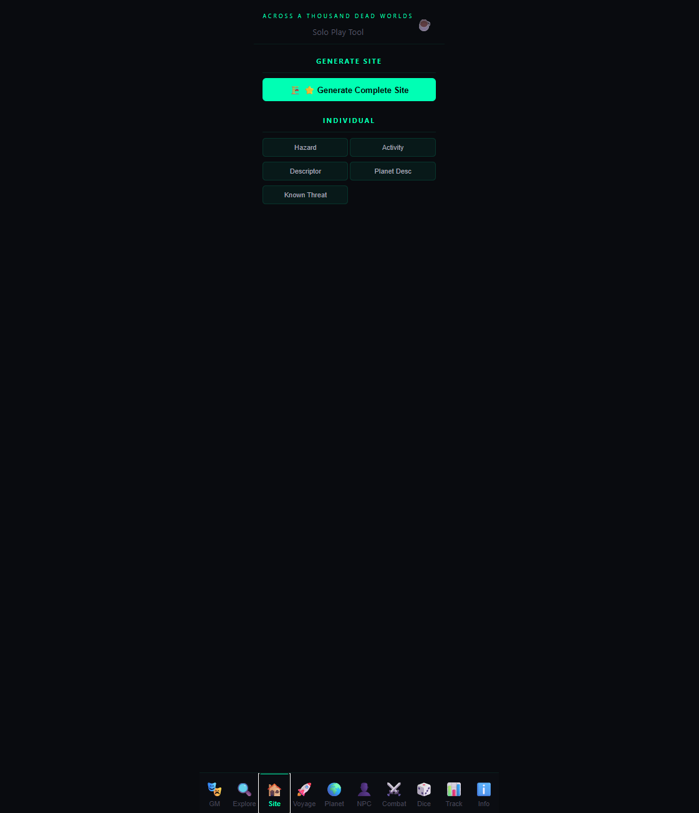
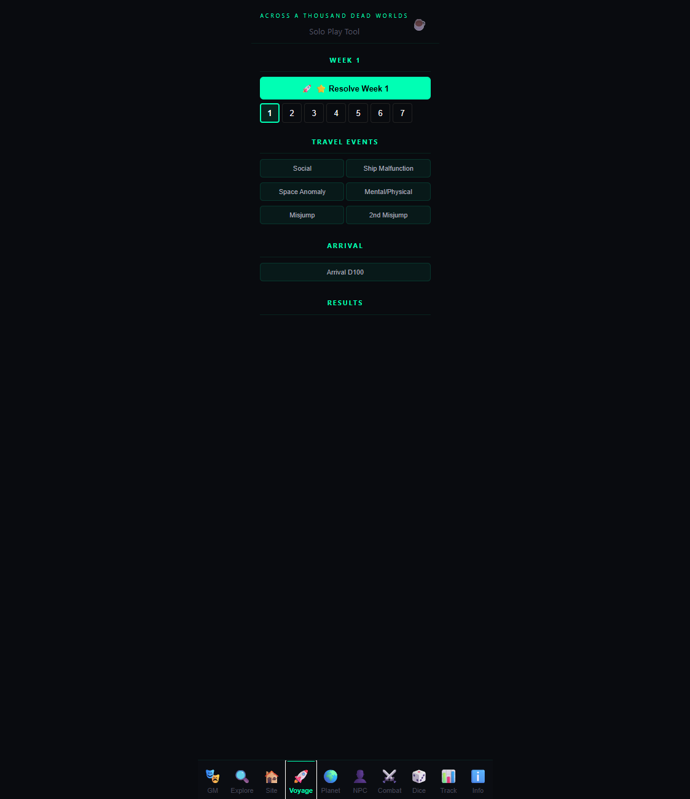
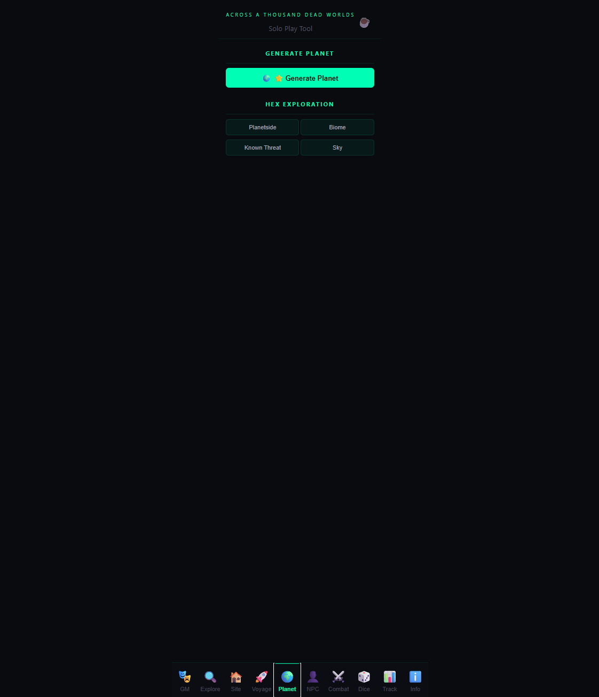
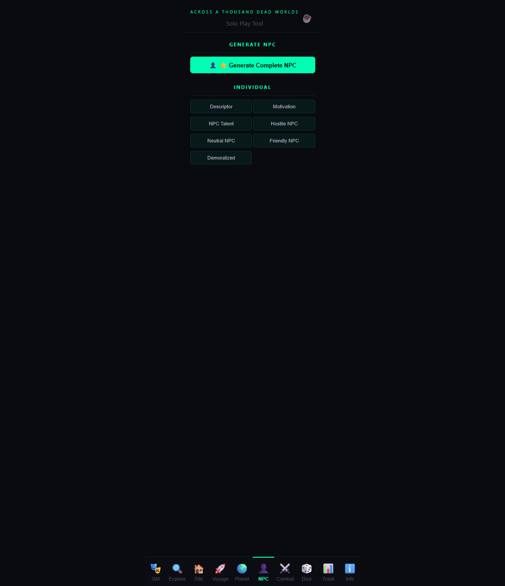
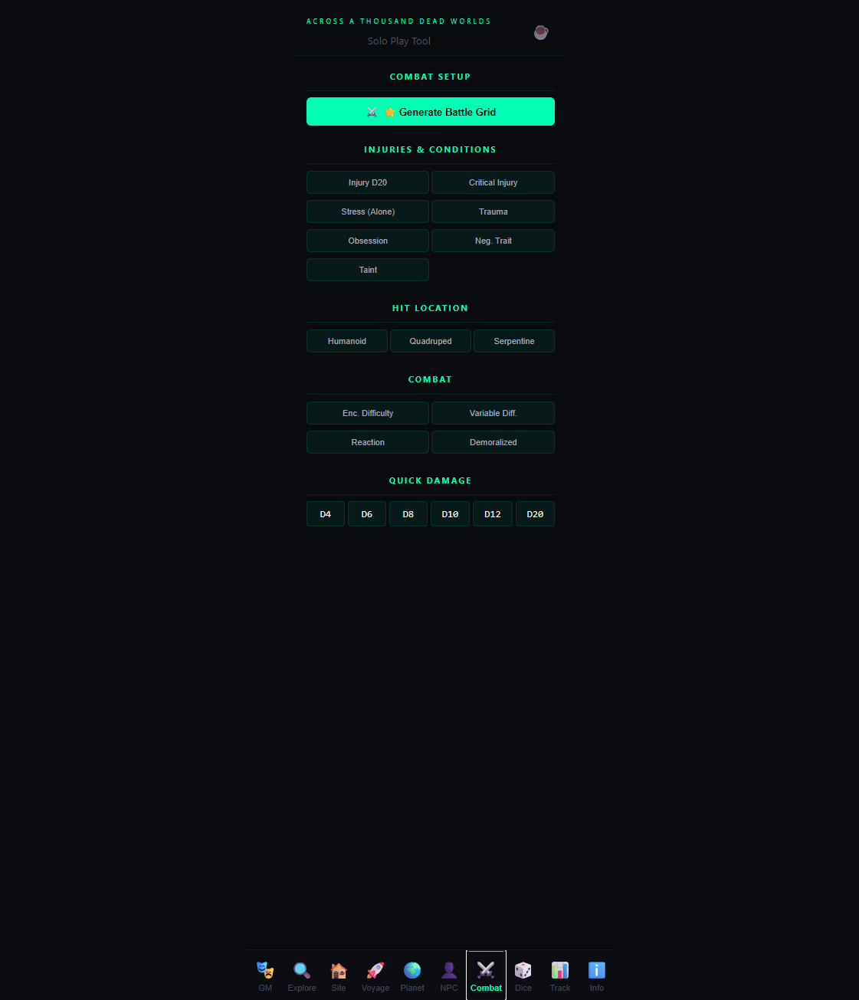
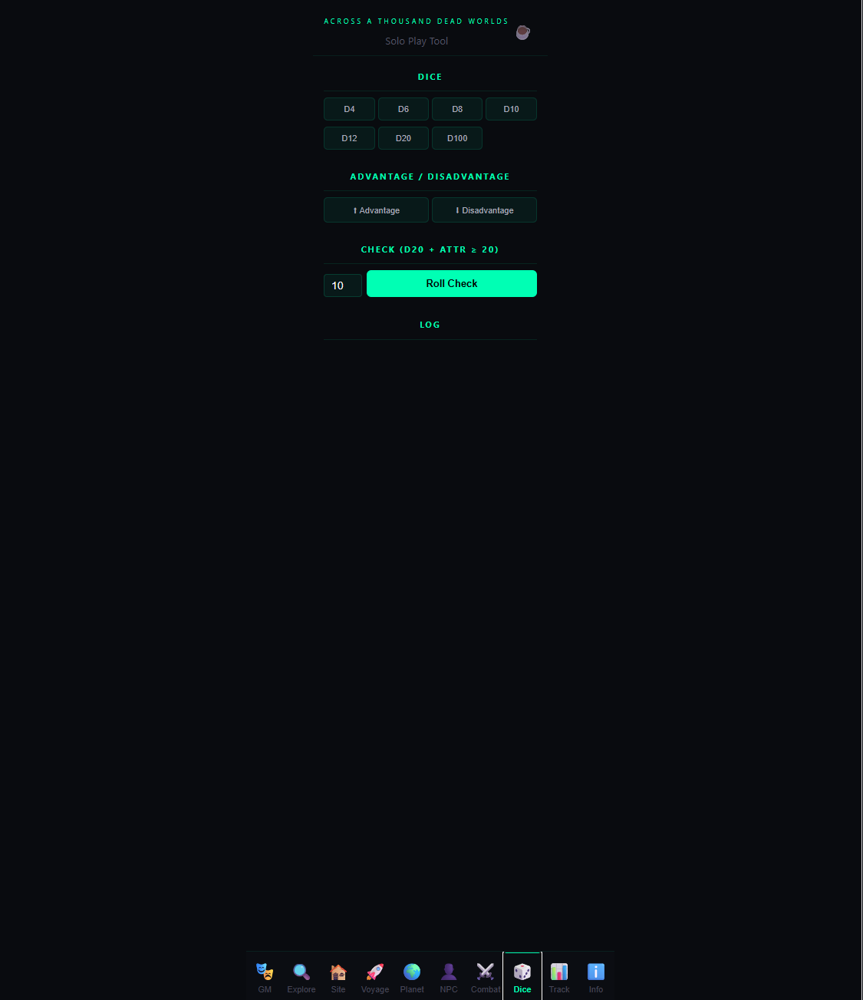
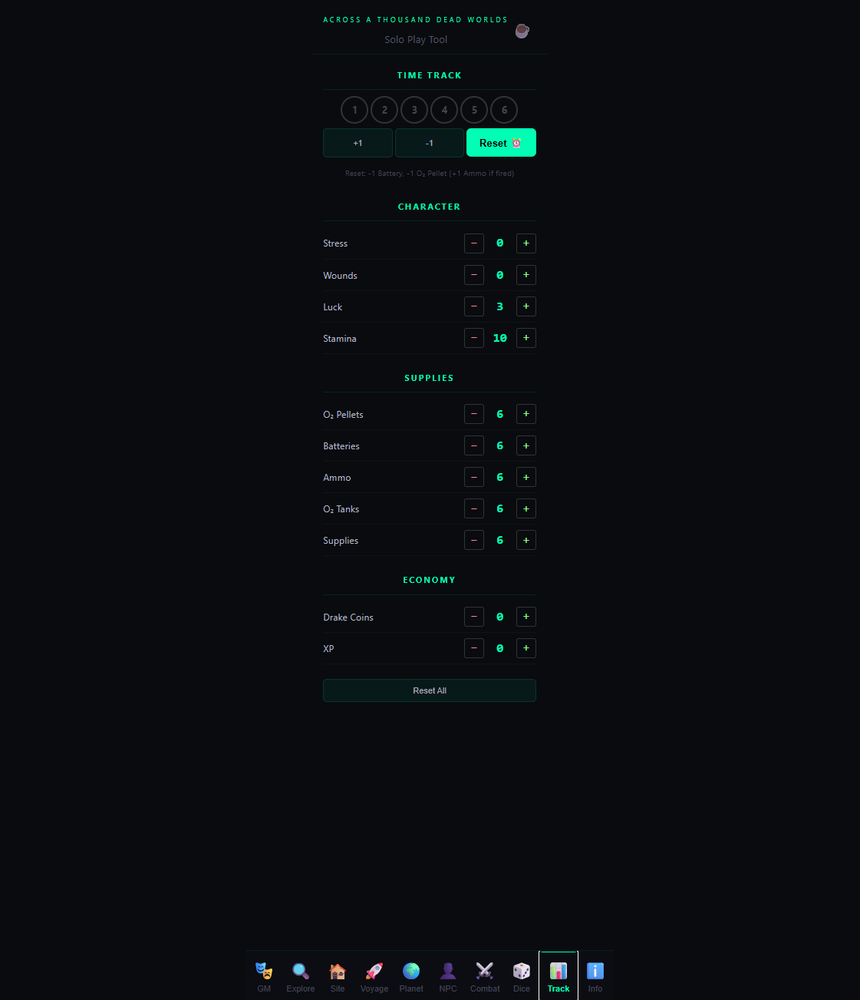
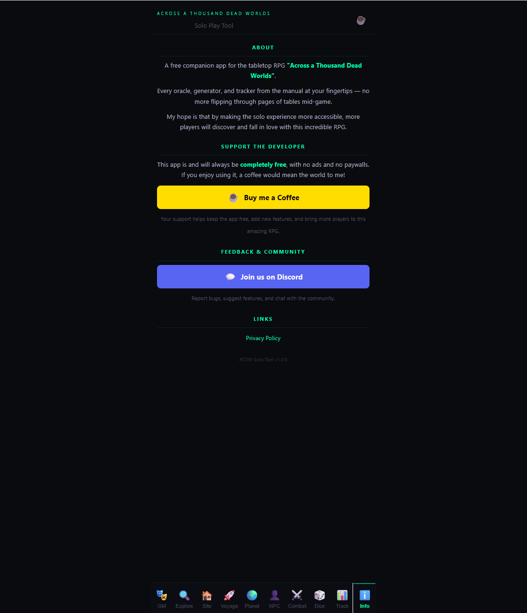

# ATDW Solo Tool

### Across a Thousand Dead Worlds — Official Solo Play Tool

A free digital companion for the tabletop RPG **"Across a Thousand Dead Worlds"** by Blackoath Entertainment.

No more flipping through pages of tables mid-game. Every oracle, generator, and tracker from the manual — right at your fingertips.

---

## Screenshots

| GM Oracle | Explore | Site Generator |
|:-:|:-:|:-:|
|  |  |  |

| Voyage | Planet | NPC |
|:-:|:-:|:-:|
|  |  |  |

| Combat | Dice | Tracker |
|:-:|:-:|:-:|
|  |  |  |

| Info & Support |
|:-:|
|  |

---

## Features

- **GM Oracle** — Prediction rolls, Action + Theme, Random Resolution, Twists, Surprise Events
- **Site Exploration** — Full area generation with connectors, encounters, hazards, doors, artifacts
- **Site Generator** — Complete site creation with name, size, activity, hazard type
- **Voyage Tracker** — Week-by-week travel with arrival checks, random events, misjumps
- **Planet Generator** — Atmosphere, climate, biome, sky, daylight cycle
- **NPC Generator** — Attributes, talent, gender, age, descriptor, motivation
- **Combat Tools** — Battle grid, hit locations, injuries, encounter difficulty
- **Dice Roller** — D4 to D100, advantage/disadvantage, attribute checks
- **Character Tracker** — Stress, Wounds, Luck, Supplies, XP (auto-saved)

---

## Use It Now

**Web App:** [https://oldpz.github.io](https://oldpz.github.io)

Works on any device — phone, tablet, or PC. No installation required.

---

## Get the Game

**[Buy "Across a Thousand Dead Worlds" from Blackoath Entertainment](https://blackoathgames.com/store/p/u1s5hb4b9xwll12yzd5bnz5h17q385)**

You need the manual to play — this app is a companion tool, not a standalone game.

---

## Support

This app is completely free, with no ads and no paywalls.

If you enjoy it, consider supporting the development:

[Buy me a Coffee](https://buymeacoffee.com/oldpz)

---

## Community

[Join us on Discord](https://discord.gg/rHUfz97V)

---

## About

Built with React + TypeScript + Vite.

My hope is that by making the solo experience more accessible, more players will discover and fall in love with this incredible RPG.

---

*"Across a Thousand Dead Worlds" is a game by Blackoath Entertainment.*
